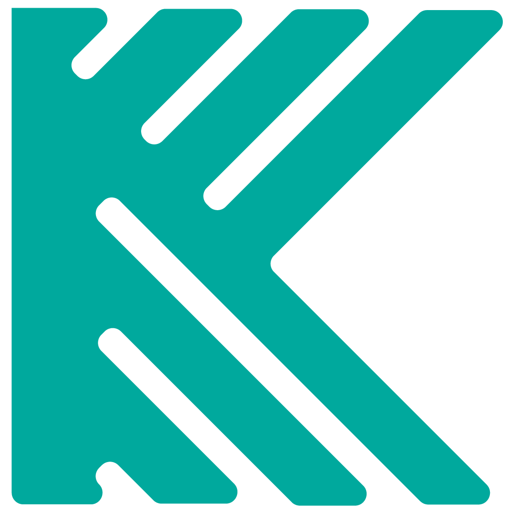

# Welcome to Exports README!

Running this **container** is relatively easy if you know what exports are neccessary and why. If you here to just quickly complete your work without getting to know why these exports are necessary, please head to the end of this README.


## Token

Your bot token. Visit [here](https://www.writebots.com/discord-bot-token/) for more information.

    -$ export TOKEN=your-token-id

## Discord Key

It is not recommeded to share this discord key with anybody. With this key, anyone can access your Account. Worry not, we are not using this key for malacious intent or something. It is something which is used to achive a channel. To know how to get this key, you can visit [this great tutorial](https://github.com/jonas747/discordlfm/issues/2).

    -$ export DISCORD_KEY=your-discord-key
> **Note:** Do not **share** this key with anybody. For more information visit the official webpage.

## Admin Channel ID

This is the ID of your admind channel where the archived channels are sent to. It is good if only a few people - like admin/manager/.. has the right to view this channel. You can follow these [steps to copy a channel ID](https://support.discord.com/hc/en-us/articles/206346498-Where-can-I-find-my-User-Server-Message-ID-).

    -$ export ADMIN_CHANNEL_ID=your-admin-channel-id

## Client/Career/Partner ticket channel ID

These are the channels ID's where the generated tickets are redirected over for the management purposes. You can use this as a record backup of the people who applied for a particular post.

    -$ export CAREER_TICKET_CHANNEL_ID=career-ticket-channel-id
    -$ export CLIENT_TICKET_CHANNEL_ID=client-ticket-channel-id
    -$ export PARTNER_TICKET_CHANNEL_ID=partner-ticket-channel-id

# TL;DR


    -$ export TOKEN=your-token-id
    -$ export DISCORD_KEY=your-discord-key
    -$ export ADMIN_CHANNEL_ID=your-admin-channel-id
    -$ export CAREER_TICKET_CHANNEL_ID=career-ticket-channel-id
    -$ export CLIENT_TICKET_CHANNEL_ID=client-ticket-channel-id
    -$ export PARTNER_TICKET_CHANNEL_ID=partner-ticket-channel-id
<p align="center">
  <a href="https://koders.in/">
    
  </a>
</p>
<p align="center">
  <i> "Your vision, Our Kreation" </i>
  <br> 
  <br> 
  An institution that caters to all your software needs with their touch of Koding.
  <br>
  <a href="https://www.koders.in"><strong>Explore More»</strong></a>
  <br>
  <br>
  <a href="https://www.github.com/koders-in">Github</a>
  ·
  <a href="https://www.linkedin.com/company/54359381/">LinkedIn</a>
  ·
  <a href="https://www.youtube.com/channel/UCZ5abFiwqKyJLIQ1Jqb6bNg">Youtube</a>
  ·
  <a href="https://www.instagram.com/koders_in/">Instagram</a>
</p>

# Introduction

This is the official repo of discord bot of Koders.

[](https://shields.io/)
 [](https://discord.gg/hGS24JC)
[](https://shields.io/)
 [](https://GitHub.com/Naereen/StrapDown.js/graphs/commit-activity)

 [](http://ForTheBadge.com)


## Table of content

- [Details](#project-details)
<!-- - [Changelog](#changelog) will be added later on-->
- [Code of conduct](#code-of-conduct)
- [Usage](#usage)
- [Commands](#commands)
- [Issues](#issues)
- [Copyright and license](#copyright-and-license)

## Project Details

- ID - X1
- Title - Integrity (Kourage now) 
- Started on - 09/04/2020

## Code of conduct

- **Pitch in!**, and offer what help you can, as there is never enough time to do everything. If you noticed that something is lacking in the documentation, you're probably right, so do generate as many issues as possible.
- Assume good intentions. English is the language of the team except for some situations, but, it is not every user's native language. Try to avoid too much slang, abbreviations, or idiomatic expressions.
- Keep it civil, courteous and polite. No personal attacks. 
- Don't waste people's time by generating unimportant issues.
- Please don't push files anywhere.
- For suggestions, please raise an issues.
- If you are a collaborator of this repository, please don't merge pull requests without confirmation from the owner.

## Structure

```
Will be added later (Check dev branch)
```

## Usage

Use prefix `&` before using any commands.

### Commands
<i> Under process, check dev branch for more </i>

### Issues

You can find all our previous updates on changelog.
Have a bug or a feature request? Please first read the code of conduct and search for existing and closed issues. If your problem or idea is not addressed yet, [please open a new issue](https://github.com/koders-in/kourage/issues).

## Copyright and license

Code and documentation copyright 2017-2021 by the [Koders](https://www.koders.in). Code released under the [MIT License](https://en.wikipedia.org/wiki/MIT_License).
<h3 align="center"> Made with ♡ by <a href="http://koders.in"> Koders </a></h3>


